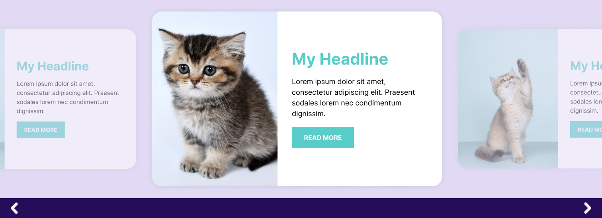

# Literati WordPress Plugin Exercise

## Setup Requirements

To work with this repository, you will need the following:

- PHP 8.0+
- [Composer](https://getcomposer.org/download/)
- [WordPress 6.4+](https://wordpress.org/download/releases/)

## Plugin Requirements

The plugin fulfills the following requirements:

1. **Promotion Post Type:** Creates a custom post type called "Promotion" with the following fields:
   - **Header**: A short title for the promotion.
   - **Text**: A detailed description.
   - **Button**: A button label.
   - **Image**: An image field for visual representation.

2. **Carousel Gutenberg Block:** Implements a carousel block based on the [provided design](https://www.figma.com/proto/cb6J47VWG0OiNHgHYrFfYJ/Literati-Example-Carousel?page-id=0%3A1&type=design&node-id=1-2&viewport=1037%2C847%2C1&t=6HoJEb2wYGRRrobI-8&scaling=scale-down&starting-point-node-id=1%3A2&device-frame=0&hotspot-hints=0&disable-default-keyboard-nav=1&hide-ui=1) (or the `.fig` file in the design-files directory) with:
   - **Transition Timer**: Allows configuration of the slide transition interval.
   - **Display Promotions**: The carousel displays published promotions.
   - **Auto Transition**: Automatically transitions between promotions based on the timer.


![Literati Build] (https://drive.google.com/file/d/1vMQzdjSH3pS7qw6sdZA9n3Gs1W8SV_k0/view?usp=sharing)

## Project Structure

This plugin uses a structure similar to other custom plugins used at Literati:

```plaintext
/design-files            # Design references and files
/literati-example        # Main plugin directory
  - /blocks              # Block-specific code
  - /includes            # Plugin-specific functions
  - /tests               # Test cases for the plugin
  - composer.json        # Composer dependencies for the plugin
  - literati-example.php # Plugin's main entry point
  - package.json         # npm dependencies, including wp-scripts
composer.json            # Composer dependencies for the entire project
Makefile                 # Make commands for managing the project
phpcs.xml                # PHP CodeSniffer configuration
phpunit.xml              # PHPUnit configuration

```

## Available Commands
All make commands are available from the root directory

```make install```
This will install the composer and npm dependencies

```make test```
This will run phpunit

```make build```
This will run any build tasks required for deploy

```make release```
This will build and package a zip file for the plugin that can be uploaded to a WordPress instance

## Plugin Configuration

1. **Install the Plugin:**
   - Upload the `literati-example.zip` file to WordPress.
   - Activate the plugin to see a new "Promotions" menu in the dashboard.

2. **Add Promotions:**
   - Go to Dashboard > Promotions > Add New to create new promotions.

3. **Add the Carousel Block:**
   - Add the Gutenberg block named "Carousel Block" to any page.
   - Set the timer and update/publish the page.

4. **View the Carousel:**
   - View the page to see the carousel with navigation controls and the configured promotions.
